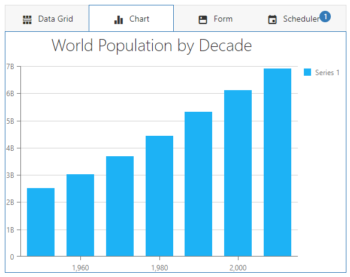

<!-- default badges list -->

<!-- default badges end -->
# TabPanel for DevExtreme - How to customize view content 

This example demonstrates how to display DevExtreme components in a TabPanel's view content area.

The implementation methods differ depending on the framework.

- In jQuery and ASP.NET Core, use the item's [template](https://js.devexpress.com/Documentation/ApiReference/UI_Widgets/dxTabPanel/Configuration/items/#template) option.

- In Vue and Angular, specify [custom templates](https://js.devexpress.com/Documentation/Guide/UI_Components/Common/Templates/#Custom_Templates).

- In React, declare components in markup.

## Files to Look At

- **jQuery**
    - [index.html](jQuery/index.html)
- **Angular**
    - [app.component.html](Angular/src/app/app.component.html)
    - [app.component.ts](Angular/src/app/app.component.ts)
- **Vue**
    - [App.vue](Vue/src/App.vue)
- **React**
    - [App.js](React/src/App.js)
- **ASP.NET Core**    
    - [Index.cshtml](ASP.NET/TabPanel/Views/Home/Index.cshtml)

## Documentation

- [Getting Started with TabPanel](https://js.devexpress.com/Documentation/Guide/UI_Components/TabPanel/Getting_Started_with_TabPanel/)

- [TabPanel - API Reference](https://js.devexpress.com/Documentation/ApiReference/UI_Components/dxTabPanel/)
